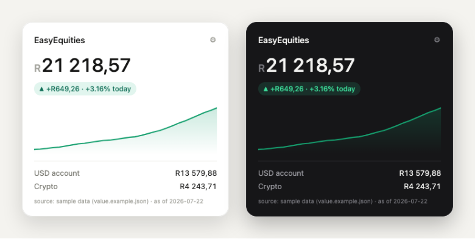

# deskfolio

A clean **macOS desktop widget** for your [EasyEquities](https://www.easyequities.co.za/)
portfolio — total value, a lifetime value chart, and a daily profit/loss indicator.
Light and dark themes, powered by [Übersicht](https://tracesof.net/uebersicht/).



> Not affiliated with, endorsed by, or connected to EasyEquities or Purple Group.
> This is an independent, unofficial tool. Nothing here is financial advice.

## Features

- **Total portfolio value** in your currency.
- **Lifetime value chart** — a smooth area chart that fills in as history accumulates.
- **Daily P/L pill** — green ▲ / red ▼ with the day's change in value and percent.
- **Top accounts** — automatically shows your highest-value accounts (e.g. USD, Crypto).
- **Settings** — a gear panel (in the browser view) to change chart range, theme,
  and how many accounts to show. Übersicht reads the same options from `config.json`.
- **Auto light/dark** to match your Mac's appearance.
- **Your data stays local** — balances live in gitignored files, never committed.

## How it works

EasyEquities has no official public API, so you feed the widget your numbers one of
three ways (all local to your machine):

| Source | Command |
|--------|---------|
| **Manual** — edit account values | edit `holdings.json`, then `python3 scripts/build.py` |
| **CSV export** from EasyEquities | `python3 scripts/update-from-csv.py path/to/export.csv` |
| **Manual login-read** | sign in yourself and type the totals into `holdings.json` |

Each refresh appends a dated snapshot to `history.json`. That history is what powers
the chart and the daily P/L, so both **fill in over the days you run it** (or instantly
if you import a CSV export that contains dated values).

## Live auto-updating prices (optional)

Instead of a fixed value, you can have the widget **track the market** — reprice your
holdings from live data on a schedule.

1. List your **share quantities** and crypto units in `holdings.live.json`
   (copy `holdings.live.example.json`).
2. Get a free **Finnhub** API key at <https://finnhub.io/register> and put it in `.env`:
   ```
   FINNHUB_API_KEY=your_key_here
   ```
3. Run it:
   ```bash
   python3 scripts/live-update.py --dry-run   # prints the math, writes nothing
   python3 scripts/live-update.py             # writes value.json
   ```
4. Schedule it (macOS) to refresh every 15 minutes:
   ```bash
   ./scripts/schedule-macos.sh                # stop: launchctl unload ~/Library/LaunchAgents/com.deskfolio.update.plist
   ```

Data sources: **Finnhub** (US stock/ETF quotes), **CoinGecko** (crypto, keyless),
**open.er-api.com** (USD→ZAR, keyless). Tip: cross-check the computed total against
what your broker shows once — if they line up, your tickers and share counts are right.

## Install

```bash
git clone https://github.com/timduigan/deskfolio.git
cd deskfolio

# 1. Install Übersicht (the desktop-widget host)
brew install --cask ubersicht && open -a Übersicht

# 2. Run setup — seeds your data files and installs the widget
./setup.sh

# 3. Enter your holdings and build
cp holdings.example.json holdings.json   # if not already created
$EDITOR holdings.json
python3 scripts/build.py
```

The widget appears on your desktop (top-left by default — drag it anywhere) and
refreshes every 60 seconds.

### Preview in a browser (no Übersicht needed)

```bash
python3 -m http.server 8000
# open http://localhost:8000/widget.html
```

## Configuration

`config.json` holds the defaults both the desktop and browser views read:

```json
{
  "currency_symbol": "R",
  "chart_range": "lifetime",   // lifetime | 1Y | 1M | 1W
  "accounts_shown": 2,          // top N accounts by value
  "theme": "auto"               // auto | light | dark
}
```

In the browser view, the **gear icon** changes these live (saved per-browser). On the
desktop, edit `config.json` and the widget picks it up on its next refresh.

## Data files

| File | Committed? | What |
|------|-----------|------|
| `holdings.json` | no (gitignored) | your account values — the manual source |
| `value.json` | no (gitignored) | generated — what the widget displays |
| `history.json` | no (gitignored) | generated — dated snapshots for the chart |
| `config.json` | yes | display settings (defaults) |
| `*.example.json` | yes | samples so the widget renders out of the box |

## Contributing

Issues and PRs welcome. This is a small, dependency-free project — the widget is one
HTML file plus a small Übersicht component, and the data scripts are plain Python 3
(no packages required).

## License

[MIT](LICENSE)
